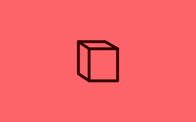

---
layout:
  title:
    visible: true
  description:
    visible: false
  tableOfContents:
    visible: true
  outline:
    visible: false
  pagination:
    visible: false
---

# Reference

|                       |                                      |       |                                                                           |
| :-------------------- | :----------------------------------- | :---- | :------------------------------------------------------------------------ |
| Trunk YAML            |    | false | [trunk-yaml](trunk-yaml/)                                                 |
| User YAML             |      | false | user-yaml.md                                                              |
| Integration for Slack |            | false | [integration-for-slack.md](../../administration/integration-for-slack.md) |
| VS Code               |          | false | [vs-code.md](../ide-integration/vs-code.md)                               |
| Neovim                |        | false | [neovim-plugin.md](../ide-integration/neovim-plugin.md)                   |
| Usage Data            |  | false | usage-data.md                                                             |
| Components            |  | false | components.md                                                             |
| Glob Path Pattern     |              | false | glob-path-pattern.md                                                      |
