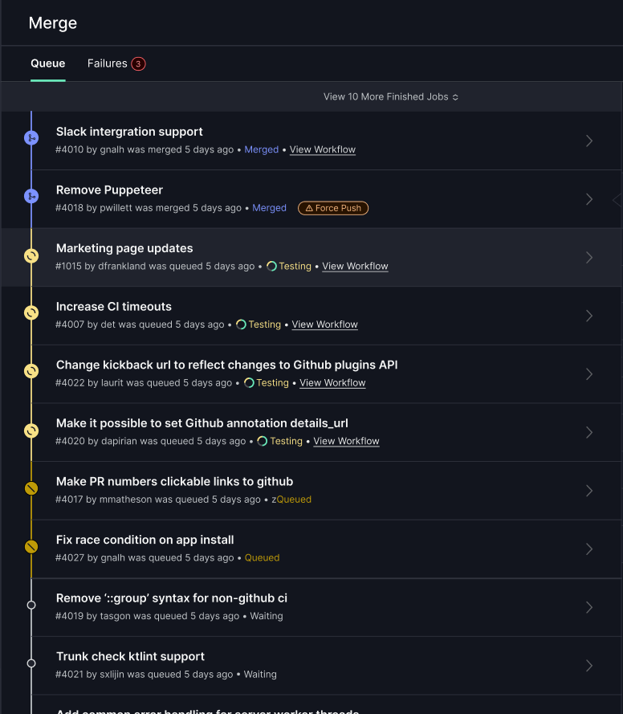
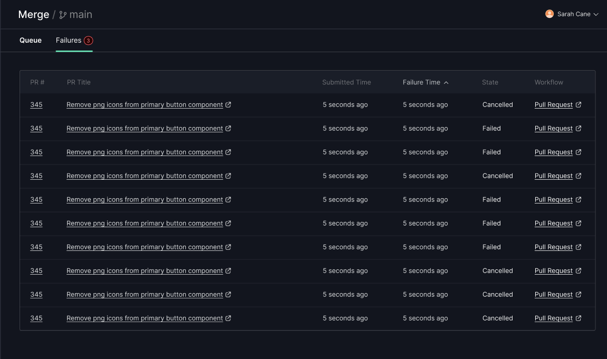
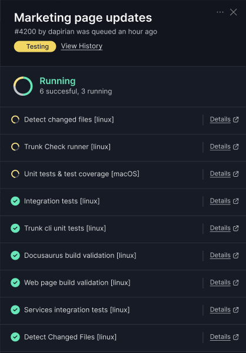
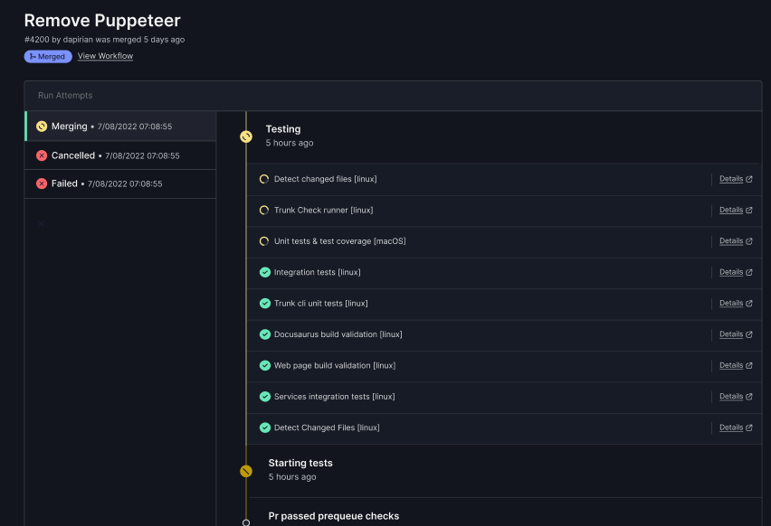

# Using the Webapp

The Trunk web app has a UI for inspecting the status of pull requests or your queue health.

## Queue Overview

The queue overview shows you which pull requests are currently in flight. \\

<figure></figure>

In this view, you can see all the pull requests currently being tested, along with their progress. Merge waits for all [required status checks](reference.md#required-status-checks) to pass before merging a pull request. You can also see any pull requests that have not begun to merge, along with which statuses they are waiting on.

## Failures View

<figure></figure>

Pull requests that fail to merge, or are canceled, do not show in the Queue Overview. Instead, they are viewable by clicking the Failures tab.

## Pull Request Details

Clicking on a pull request in the queue overview will open a sidebar pane with relevant details for the status of that pull request.\\

<figure></figure>

Clicking "View History" will give you a full audit trail for a pull request.

<figure></figure>

This view displays a timeline for a pull request, including when it was submitted, when it began testing, and details about any time it had to restart tests. For pull requests that failed and had to be resubmitted, you'll also be able to view the timeline of each submission.
